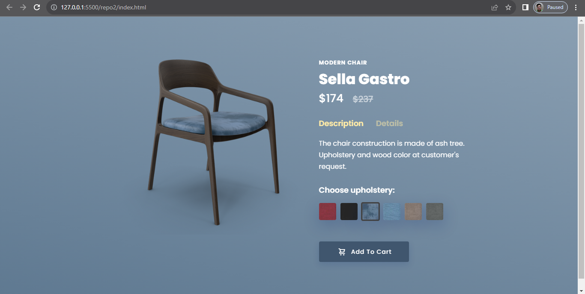

#  This is a project only for practice
<!---
The project has been downloaded
from a website and has been used only for 
learning purpose.
-->

Link for this project can be found [here]('https://www.codewithfaraz.com/content/38/create-a-responsive-animated-product-page-with-html-and-css#html-code').

## Create a Responsive Animated Product Page with HTML and CSS

<link rel="stylesheet" href="styles1.css" />

    

    
    

    

    
    

    

### Table of Contents:

1. [Project Introduction](#project-introduction)
2. [HTML Code](#html-code)
3. [CSS Code](#css-code)
4. [Preview](#preview) 
5. [Conclusion](#conclusion)

#### Project Introduction
- In today's digital age, having a visually appealing and interactive product page can make all the difference when it comes to attracting and retaining customers. This tutorial will teach you how to create a responsive animated product page with HTML and CSS. This tutorial is perfect for web developers and designers looking to enhance their skills in front-end development. We'll cover the best practices for creating interactive and visually stunning product pages that are optimized for mobile and tablet devices.

- Before you dive into creating your product page, it's important to identify your target audience and research design and development best practices. This will help you create a product page that is visually appealing and optimized for user experience. Once you've identified your target audience and researched best practices, create a wireframe or prototype of your product page to help you visualize the layout and design.

- Creating an animated product page can be tricky, whether for a physical product or an e-commerce site. But with the help of HTML and CSS, you have full control over your website's design and how it functions.

This tutorial will show you how to create a responsive animated product page using HTML and pure CSS.

#### HTML Code

This is the link for the [HTML file](index.html).

#### CSS Code

This is the link for the [CSS file](styles.css).

#### Preview

#### Conclusion

In this tutorial, we've covered the basics of creating a responsive animated product page with HTML and CSS. By using a combination of HTML structure, CSS styling, and user interactivity, you can create a visually appealing and engaging product page that is optimized for both desktop and mobile devices. Keep in mind the importance of designing for your target audience and using best practices in front-end development. With these tips and techniques, you'll be well on your way to creating a product page that stands out from the crowd.

